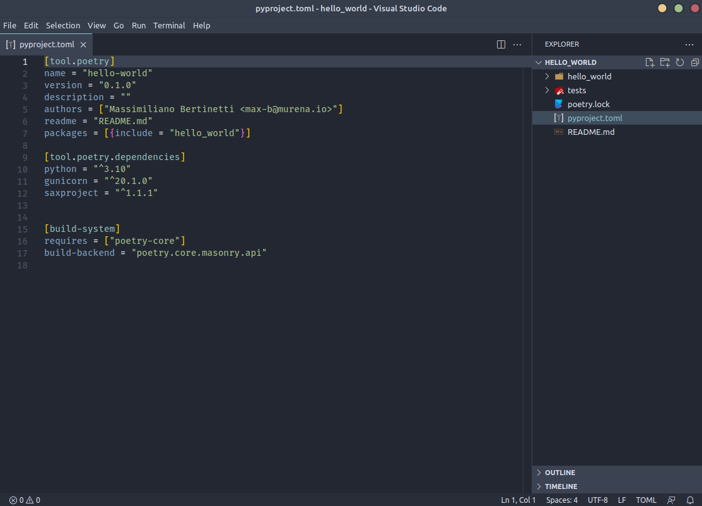

<div style="text-align: center;">

# Saxproject
### Un semplice framework Python con impostazioni predefinite dogmatiche

</div>

&#xa0;

### 🎯 A proposito

Saxproject è un framework web Python costruito per scopi di apprendimento e si sta evolvendo per lavorare su progetti reali. 

È un framework WSGI e può essere utilizzato con qualsiasi server di applicazioni WSGI come [Gunicorn](https://gunicorn.org/). 

In questa documentazione puoi imparare come funziona il framework e come lo uso per il lavoro pratico quotidiano.

### Crea il primo progetto

Saxproject usa Python v3.10+. Io uso [Poetry](https://python-poetry.org/) per gestire le dipendenze e la pacchettizzazione, e [Visual Studio Code](https://code.visualstudio.com/) come editor.

```shell
poetry new hello_world

cd hello_world

poetry add gunicorn

poetry add saxproject
```

Apri VSCode es.

```shell
code .
```



Crea un file nella cartella **hello_world**, ad es. **app.py**:

```python
# app.py

from saxproject.api import API

app = API()

@app.route("/")
def hello(request, response):
    response.text = "Hello, World!"
```
Ora apuoi eseguirlo:

```shell
poetry run gunicorn hello_world.app:app
```
Lascia perdere per il momento l'avvertimento circa la necessità di una directory static. Se vai sul tuo browser all'indirizzo  http://127.0.0.1:8000/ vedrai:


<div align="center">

## Ok, ora sei uno sviluppatore web!

</div>