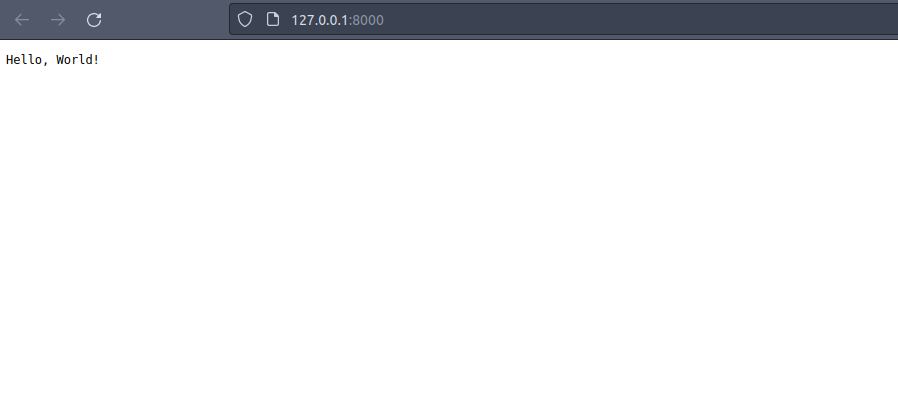

### Create the first project

Saxproject use Python v3.10+. I use [Poetry](https://python-poetry.org/) for dependency managent and for python packaging, and [Visual Studio Code](https://code.visualstudio.com/) as an editor.

If you need help on getting ready on your PC, refer to [Installation](/installation.md)

```shell
poetry new hello_world

cd hello_world

poetry add gunicorn

poetry add saxproject
```

Open VSCode e.g.

```shell
code .
```


Create a file in the **hello_world** directory, such as **app.py**:

```python
# app.py

from saxproject.api import API

app = API()

@app.route("/")
def hello(request, response):
    response.text = "Hello, World!"
```
Now you car run it:

```shell
poetry run gunicorn hello_world.app:app
```
Let alone for now that is present a warning about the need of a static directory. 
If you go on your browser at http://127.0.0.1:8000/ you will see:



<div align="center">

## Ok, now you are a web developer!

</div>